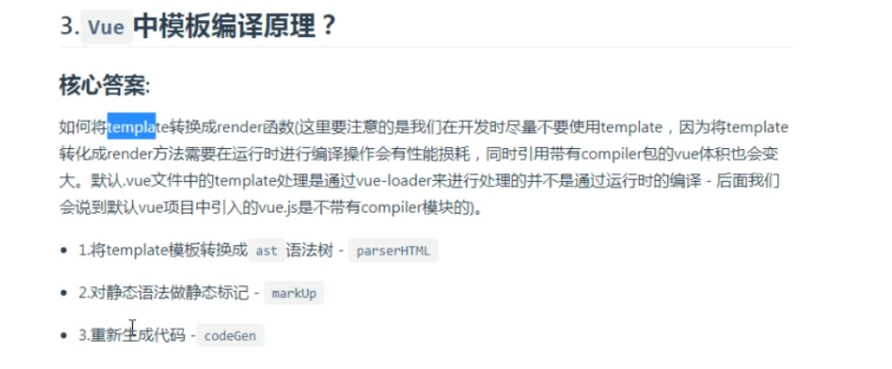

#2020全新 最火Vue面试题训练营
##响应式数据的理解
+ （数组和对象类型值变化如何劫持到），对象内部通过defineReactive方法，使用Object.defineProperty（对象键值对比较多时，重写每个键值对的取值和赋值操作效率比较低）将属性进行劫持，数组这是重写数组方法实现
>多层对象是通过递归来实现劫持，Vue3是通过proxy来实现响应式数据（缺点浏览器兼容性不太好）
>内部依赖收集是如何做到的？ 每个属性都拥有自己的dep属性，存放他所依赖的watcher，当属性变化后会通知自己对应的watcher去更新
>性能优化：1）层级过深效率低 2）不需要响应数据内容不要放到data中 3）Object.freeze()可以冻结数据

##Vue如何检测数组变化
+ 重写数组（push,pop\shift\unshift\splice\sort\reverse）七个方法
>在Vue中修改数组的索引下某个值(和长度)是无法监控的，需要通过以上七种方法修改数组才会触发数组对应的watcher进行更新。数组元素如果是对象类型也会进行递归劫持
>Vue.$set()

##Vue模板编译原理
+ 默认的.vue文件template是通过vue-loader来进行处理的，并不是运行时编译，默认vue项目中引入vue.js是不带compiler模块
;
+ 将template模板转换成ast语法树
+ 对静态语法做静态标记
+ 重新生成代码

##生命周期钩子是如何实现的？
+ Vue的生命周期钩子本质是回调函数，当创建组件实例的过程中会调用对应的钩子方法
>内部主要使用callHook方法来调用对应的方法，核心是一个发布订阅的模式，将钩子订阅好（内部采用数组的方式存储），在对应的阶段进行发布

##Vue.mixin的使用场景和原理
+ 作用就是抽离公共的业务逻辑，原理类似对象的继承，当组件初始化时会调用mergeOptions方法进行合并，采用策略模式针对不同的属性进行合并。
如果混入的数据和本身组件中的数据冲突，会 采用就近原则以组件的数据为准
>补充 mixin中有很多缺陷，“命名冲突问题”、“数据来源问题” vue3中去掉该语法

##nextTick在哪里使用？原理是？
+ nextTick中回调是在下次dom更新循环结束之后执行的延迟回调。在修改数据之后立即使用这个方法，获取更新后的DOM。
原理就是异步方法（promise\mutationObserver\setImmediate\setTimeout）经常与事件循环一起问（宏任务、微任务）
>vue 多次更新数据，最终会进行批处理，内部调用的就是nextTick实现延迟更新。

##Vue为什么需要虚拟DOM？
+ virtual DOM 就是用js对象来描述真实DOM,是对真实DOM的抽象，由于直接操作DOM性能低但是js操作效率高，可以将DOM操作转化为对象操作，最终通过diff算法对比差异进行更新DOM
虚拟DOM不依赖真实平台环境也可以实现跨平台。

##vue中的diff原理
+ vue的diff算法是平级比较，不考虑跨层级比较。内部采用深度递归+双指针的方式进行比较

##Vue.set方法是如何实现的？
+ 为什么$set可以触发更新，我们给对象和数组本身都增加了dep属性。给对象新增不存在的属性则触发对象依赖的watcher去更新，当修改数组索引是我们调用数组本身的splice方法去更新数组

##Vue生命周期有哪些？一般在哪一步发起请求及原因
+ beforeCreate 在实例化之后，观测(data observer)和event/watcher事件配置之前被调用
+ created 实例已经创建完成之后被调用
+ beforeMount 在挂载之前被调用：相关的render函数首次被调用
+ mounted el被新创建的vm.$el替换，并挂载到实例上去之后调用改钩子，可以进行DOM操作  http请求
+ beforeUpdate 数据更新是调用， 发生在虚拟dom重新渲染和打补丁之间
+ updated 数据变更，重新渲染之后
+ beforeDestroy 实例销毁之前调用。这一步，实例依然可用
+ destroyed Vue实例销毁之后调用  清除定时器
