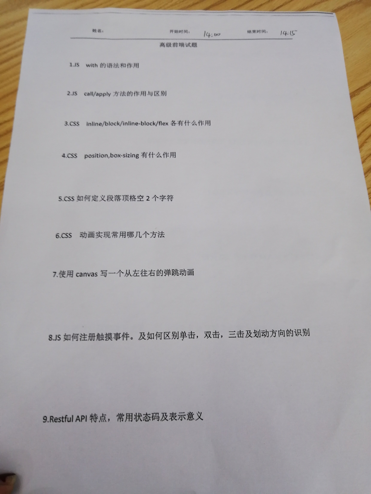

;
##2、call/apply/bind
>都是数组上的方法，用于改变this指向，区别在于传递参数的方式call一个一个传，apply把参数放在数组里传递,bind跟apply类似

##3 inline:行内 block:块级 inline-block: 行内块级 flex：弹性盒子
##5 
```angular2
p{
   text-indent: 2em;                
}
```

##css动画
+ transition  
    img{ transition: 1s 1s height ease;}
    //ease表示逐渐放慢  linear:匀速 ease-in:加速  ease-out: 减速  cubic-bezier：自定义速度模式
+ animation 需要指定动画一个周期持续的时间，以及动画效果的名称
    div:hover{animation: 1s rainbow  3}
    @keyframes rainbow {
      0% { background: #c00; }
      50% { background: orange; }
      100% { background: yellowgreen; }
    }
    
##Restful API特点，及常用状态码表示意义    
+ 指令结构：动词+宾语
> example: GET/articles
+ 五种HTTP方法
    + GET: 读取(read)
    + POST: 新建(create)
    + PUT: 更新(update)
    + PATCH: 更新（update），通常部分更新
    + DELETE: 删除（delete）
    >根据HTTP规范，动词一律大写

                                                                                                                                      >
+避免多级URL:除了第一级以外，其他级别用查询字符串表达                                                                                                                                      >
>GET /authors/12?categories=2

##HTTP状态码
+ 1xx:相关信息
+ 2xx:操作成功
+ 3xx:重定向  301永久重定向 302暂时重定向
+ 4xx:客户端错误
    + 400 Bad Request：服务器不理解客户端的请求，未做任何处理。
    + 401 Unauthorized：用户未提供身份验证凭据，或者没有通过身份验证。
    + 403 Forbidden：用户通过了身份验证，但是不具有访问资源所需的权限。
    + 404 Not Found：所请求的资源不存在，或不可用。
    + 405 Method Not Allowed：用户已经通过身份验证，但是所用的 HTTP 方法不在他的权限之内。
+ 5xx:服务器错误
    +500 Internal Server Error：客户端请求有效，服务器处理时发生了意外。
    +503 Service Unavailable：服务器无法处理请求，一般用于网站维护状态。
                                                                                                                                  >
##跨域
+ JSONP
> <script>  <iframe> <link>等带src属性的标签都可以跨域加载资源

+ PC端项目 跨域代理
```angular2
module.exports = {
    proxy: {
        '/api': {
            target: 'http://139.196.151.29:8097',//'http://192.168.1.65:8080',  // 跨域地址
            secure: false,  // 如果是https接口，需要配置这个参数
            changeOrigin: true,  //是否跨域
            pathRewrite: {
                '^/api': ''   //用/api 代替target里面的地址，  比如'/api/user/add' 相当于 http://192.168.1.65:8080/user/add
            }
        }
    }
}
+ 小程序里后台开发配置
``` 

##正则匹配非字母数字和下划线
var reg = /[^\w]/                                                                                                                            
                        


##常见web前端攻击，如何防御？
+ XSS攻击
    +xss过滤
    +CSP
    +转义字符

+ CSRF 跨站请求伪造
    +验证码
+ SQL注入
    +查询语句建议使用后端提供参数化的查询接口
+ DDOS   
    + 备份网站
    + 高仿IP 
                        
                        
                        
                        
                        
                        
                        
                        
                        
                        
                        
                                                                                                                                  